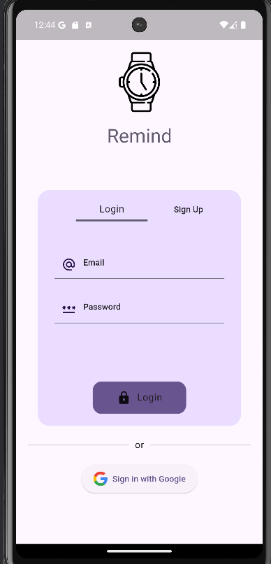
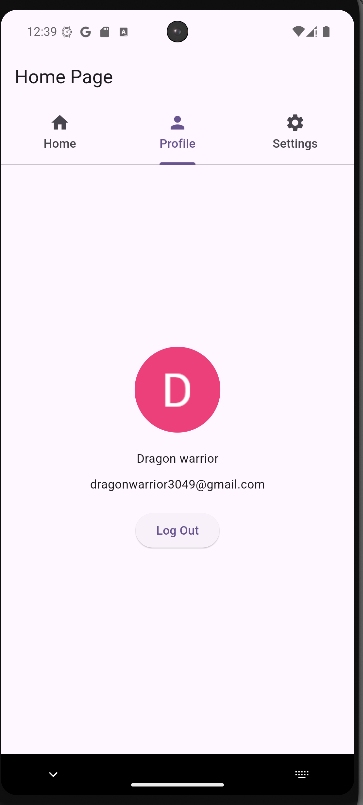
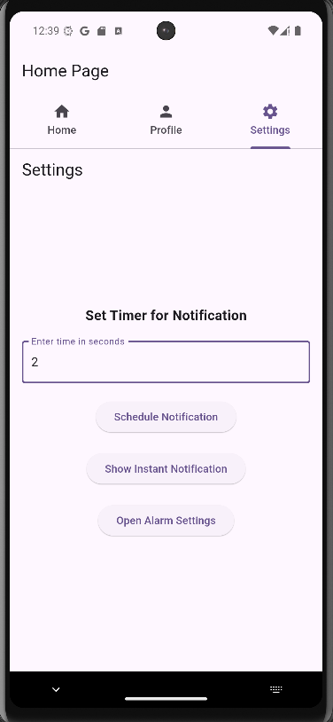

# 🕒 Remind App

A **Flutter-based Reminder App** that allows users to schedule and receive notifications for important tasks.

---

## 📌 Features
✅ Schedule notifications at a specific time  
✅ Instant notifications  
✅ Background notification handling  
✅ Permissions handling (Android 13+ supported)  
✅ Uses `flutter_local_notifications` and `timezone` packages

---

## ## 🎥 Demo Video


---

## 🖼️ Screenshots

| Home Screen             | Notification Popup       | Scheduled Notification       |
|-------------------------|--------------------------|------------------------------|
|  |  |  |

📌 *Ensure that your images are inside the `assets` folder in the GitHub repository for them to be visible.*

---

## ⚙️ Installation

### 1️⃣ Clone the repository
```bash
git clone https://github.com/DhruvChaurasia9403/remind-app.git
cd remind-app
